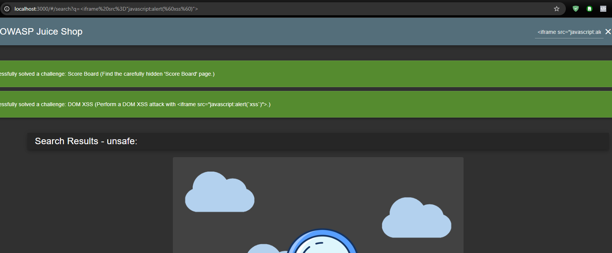
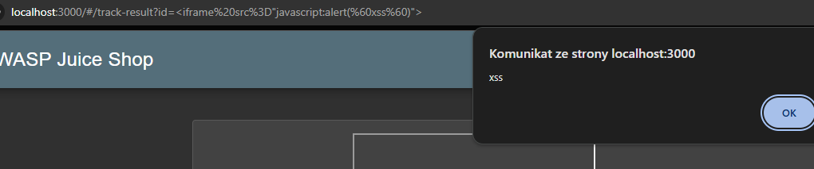
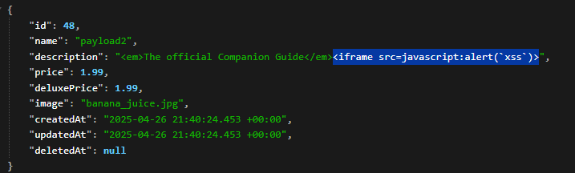
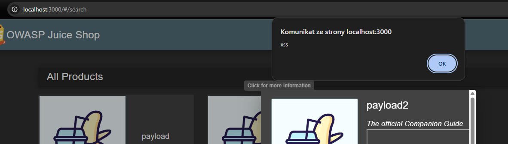
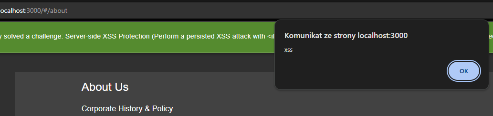
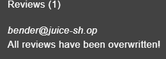
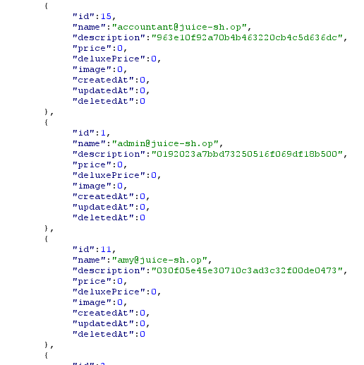
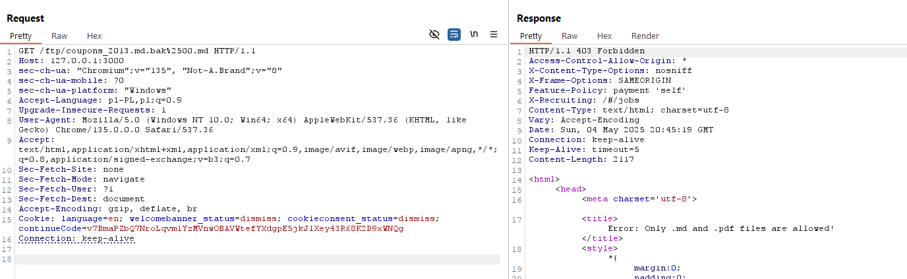

# Projekt BAIM - łatanie podatności juice shop-a
## XSS
### channalge: DOM XSS i Bonus Payload
użycie podatej funkcji DOM sanitizer w search-result.component.ts
```
abstract bypassSecurityTrustHtml(value: string): SafeHtml;
    /**
     * Bypass security and trust the given value to be safe style value (CSS).
     * **WARNING:** calling this method with untrusted user data exposes your application to XSS
     * security risks!
     */
```

aby naprawić tą podatność wystarczyło dodać sanityzację parametru searchValue:

```
this.searchValue = this.sanitizer.sanitize(SecurityContext.URL,queryParam)
```



### challange: reflected XSS


endpoint track-result?id= jest podatny na XSS,
pod spodem jest odpytanie /rest/track-order/ z trackOrders.ts, jest tam niesanityzowany parametr id, podatność można naprawić działając na zsanityzowanej kopii id:
```
const sanitized = security.sanitizeSecure(req.params.id)
```
po tej zmianie nie da sie wywołać refelcted XSS 

### challange: API  persisted XSS
Za pomocą otwartego endpointu /api/products można dodawać produkty i je przeglądać pod /rest/products/search

```
curl -X POST http://localhost:3000/api/products -H "Authorization: Bearer XXXXX" --data "name=payload2&description=<em>The</em><iframe src="javascript:alert(`xss`)">&price=1.99&deluxePrice=1.99&image=banana_juice.jpg"
```





aby naprawić tą podatność wystarczyło dodać sanityzację w search-result.component.ts:
```
tableData[i].description = this.sanitizer.sanitize(SecurityContext.HTML,tableData[i].description)
```

### challange: persisted xss user challage

podczas modyfikacji nazwy użytkownika metodą POST '/profile', updateUserProfile.ts wywkoływana jest funckja user.update:
```
set (username: string) {
          if (utils.isChallengeEnabled(challenges.persistedXssUserChallenge)) {
            username = security.sanitizeLegacy(username)
          } else {
            username = security.sanitizeSecure(username)
          }
          this.setDataValue('username', username)

...
export const sanitizeLegacy = (input = '') => input.replace(/<(?:\w+)\W+?[\w]/gi, '')
```
funckja sanitize legacy pozwala na </p><p s<<p simg src="x" onerror="alert('demo')" /></img>

### Challange: presisted XSS server side protection
za pomocą odpowiednio spreparowanego POST na /api/Feedbacks/ możemy wymusić zamieszczenie komentarza z XSS: 
```
{"UserId":1,"captchaId":0,"captcha":"486","comment":"<<iframe src=\"javascript:alert(`xss`)\">iframe src=\"javascript:alert(`xss`)\">","rating":"2"}
```

wynik:
```
"status":"success","data":{"id":15,"UserId":1,"comment":"<iframe src=\"javascript:alert(`xss`)\">","rating":2,"updatedAt":"2025-04-27T22:41:47.598Z","createdAt":"2025-04-27T22:41:47.598Z"}
```


wynika to z wykorzystania podatnej funkcji w implementacji feedback.ts która nie sanityzuje rekursywnie
```
export const sanitizeHtml = (html: string) => sanitizeHtmlLib(html)
```
zamiana tego na "sanitizedComment = security.sanitizeSecure(comment)" eliminuje możliwość xss


## INNE

### NOSQL manipulation
za pomocą metody PATCH można wysłać w JSONie obiekt który zwróci dopasowanie do wielu dokumentów w mongodb
```
PATCH /rest/products/reviews 
Authorization: Bearer XXX

{
  "id": { "$gt": "" },
  "message": "All reviews have been overwritten!"
}

```
można za pomocą tego nadpisać wiele wpisów na raz 



aby naprawić te podatnośc wystarczy wprowadzić weryfikację czy typ ID jest taki sam jak typ przesłanego ID

```
const id = typeof req.body.id === 'string'
    ? new String(req.body.id)
    : null;
    if (!id) throw new Error('Invalid id')
```
### SQL injection w parametrze search query
podatna końcówka GET /rest/products/search?q=

za pomocą złośliwie przygotowanego query można wykonać UNION Based SQL injection i wylistować wszystkich uzytkowników oraz hasze haseł:
```
a%')) UNION SELECT id,email as name,password as description,0 as price,0 as deluxePrice,0 as image,0 as createdAt,0 as updatedAt,0 as deletedAt FROM Users ORDER BY image; --
```


aby naprawic tę podatnośc wystarczy poprawić ten kawałek kodu:
```
models.sequelize.query(`SELECT * FROM Products WHERE ((name LIKE '%${criteria}%' OR description LIKE '%${criteria}%') AND deletedAt IS NULL) ORDER BY name`)
```
na używający podstawień od sequelize które nie sklejają bezpośrednio danych użytkownika

```
models.sequelize.query(`SELECT * FROM Products WHERE ((name LIKE ? OR description LIKE ?) AND deletedAt IS NULL) ORDER BY name`,{replacements: [ `%${criteria}%`, `%${criteria}%` ]}) 
```

### Oauth access_token spam
wchodząc pod stronę przez link poniżej jesteśmy w stanie zalogować się access_tokenem wygenerowanym w innej aplikacji.
```
https://local3000.owasp-juice.shop#access_token=XXXXXXX&token_type=Bearer&expires_in=3599&scope=email%20openid%20https://www.googleapis.com/auth/userinfo.email&authuser=0&prompt=consent
```
Pod spodem javascript bierze sobie te parametry i ma uprawnienia do pobrania z endpointu google "userinfo.email",
funkcja "oauthLogin" w user.service.ts przekazuje surowego pobranego jsona do obiektu "profile" w klasie "OAuthComponent.ts".
Następnie hasło ustawiane jest jako BASE64 zakodowany odwrócony email. przykładowo - lp.tset@tset. 
```
const password = btoa(profile.email.split('').reverse().join(''))
```
Da się zalogować tak przygotowanym hasłem, pomijając Oauth - lepeij użyć w tym celu niepublicznego ID lub całkowicie zmienic schemat tworzenia użytkowników.
Da się także zalogować za pomocą tokena google wygenerowanego w innej aplikacji
Aby to uniemożliwić, a także aby wprowadzić weryfikację czy token został zarequestowany przez frontend wcześniej można wprowadzić dodatkową logikę do funkcji oauthLogin w user.service.ts wweryfikującą token i parametr state przekierowania
```
oauthLogin (params: any): Observable<any>{
    const tokenInfoUrl = `https://oauth2.googleapis.com/tokeninfo?access_token=${params.access_token}`;
    const userInfoUrl  = `https://www.googleapis.com/oauth2/v1/userinfo?alt=json&access_token=${params.access_token}`;

    return this.http.get<{ aud: string }>(tokenInfoUrl).pipe(
      switchMap(tokenInfo => {
        const goodAud   = tokenInfo.aud === clientId;
        const goodState = params.state === localStorage.getItem('oauthState');
        if (goodAud && goodState) {
          return this.http.get(userInfoUrl);
        } else {
          return this.whoAmI();
        }
      })
    )
  }
```


### SQL injection w login page 
login page pozwala zalogować się na admina  przy użyiu payloadu:
```
' or 1=1;--
```

wynika to z konkatenacji łańcóchów znaków do query bez sanityzacji. Wystarczy w tym celu wykorzystać podstawienia:
```

models.sequelize.query(`SELECT * FROM Users WHERE email = ? AND password = ? AND deletedAt IS NULL`, { model: UserModel, plain: true , replacements: [ `%${req.body.email}%`, `%${security.hash(req.body.password)}%` ]})
```

### zatrucie NULL byte pozwala na pobranie tajnego pliku
przechodząc pod url: 
```
http://ip:port/ftp/coupons_2013.md.bak%2500.md
```
można pobrac plik .bak
problemem jest funkcja endsWithAllowlistedFileType w fileServer.ts która nie zawiera odpowiedenigo pełnego dekodowania.
poprawka kodu: 
```
let decoded = param;
    try {
      let prev: string;
      do {
        prev    = decoded;
        decoded = decodeURIComponent(decoded);
      } while (decoded !== prev);
    } catch {
      return false;
    }
    if (decoded.includes('\0')) {
      return false;
    }
```



###